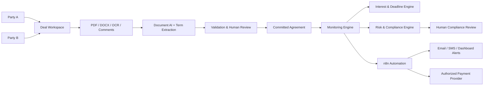

# DealEscrow

**DealEscrow** is a research-oriented AI-assisted platform for digitally managing conditional financial agreements between two parties. It is designed as a **support and orchestration layer**, not as a bank, law firm, credit bureau, or autonomous legal decision-maker.

A deal can contain uploaded PDF/DOCX/images, OCR text, written comments, repayment terms, deadlines, grace periods, interest rules, identity records, subscription information, payment instructions, and consent records. AI agents extract proposed structured terms; the parties review and explicitly commit to the final agreement before monitoring begins.

## Core workflow

## Research goals

- Document intelligence for PDF, DOCX, images and OCR.
- LLM-based extraction of parties, principal, repayment date, grace period, interest clauses and obligations.
- Deterministic financial calculations separated from LLM reasoning.
- Agreement versioning, audit trails and explicit bilateral acceptance.
- Deadline monitoring and event-driven n8n workflows.
- Consent-based payment orchestration through licensed payment providers.
- Subscription tracking and entitlement controls.
- Explainable internal risk signals based on activity inside DealEscrow.
- Human review for legal/compliance-sensitive actions.
- Privacy-by-design and data-minimisation architecture.

## Important design rule

AI **does not invent binding terms**. For example, if a document does not specify “5% annual interest after 45 days”, the system may flag the missing term or provide a configurable proposal, but that proposal becomes operative only after both parties explicitly accept it and the relevant legal/compliance checks pass.

Likewise, bank-account debits are never performed merely because an AI agent decides that money is due. Payment execution requires an appropriate authorization/mandate and a compliant payment-service integration.

## Repository map

- `src/dealescrow/` — Python domain, AI-agent, risk, compliance and calculation services.
- `api/` — FastAPI website/backend entry points.
- `workflows/n8n/` — automation blueprints.
- `docs/` — architecture, AI, legal/compliance, research and data-model documentation.
- `data/templates/` — CSV schemas/templates for research and local development.
- `tests/` — deterministic unit tests.

## Suggested deal states

`DRAFT -> EXTRACTED -> REVIEW_REQUIRED -> PROPOSED -> BOTH_ACCEPTED -> ACTIVE -> DUE -> GRACE -> OVERDUE -> DISPUTED/SETTLED/CANCELLED`

## Germany/EU compliance baseline

The repository treats regulation as a first-class engineering constraint. Operating a credit-intermediation or payment platform can trigger authorization requirements depending on the exact business model. Direct debit requires valid authorization/mandate. Personal-data processing should follow purpose limitation and data minimisation. Criminal-conviction/offence data is especially restricted and should not be collected as a generic “PCC” profile field without a specific lawful basis.

See `docs/COMPLIANCE_GERMANY_EU.md` for the engineering interpretation and source links.

## Status

Research prototype / engineering reference architecture. It is **not legal advice, financial advice, a production payment institution, or a production credit-scoring service**.
