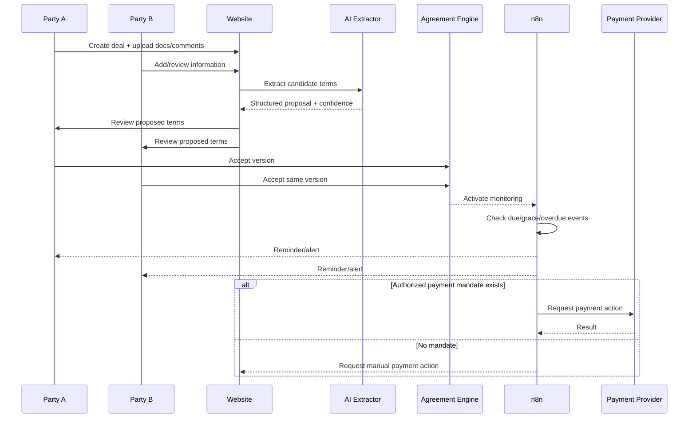

# DealEscrow Architecture

## System intent

DealEscrow supports two parties who want to record, accept, monitor and settle a conditional financial agreement. AI assists with extraction and summarisation; deterministic services own calculations and state transitions.

## Components

1. **Web application**
   - Deal creation, uploads, comments, acceptance and dashboard.
   - FastAPI backend with REST endpoints.
2. **Document Intelligence**
   - PDF/DOCX/image ingestion.
   - OCR adapter interface.
   - LLM extraction into validated JSON.
3. **Agreement Engine**
   - Versioned terms.
   - Bilateral acceptance.
   - Immutable acceptance events.
4. **Finance Engine**
   - Principal, annual/simple interest, grace periods, day-count calculations.
   - No hidden AI arithmetic.
5. **Monitoring Engine**
   - Due dates, grace expiry, overdue transitions, reminders.
6. **n8n Automation**
   - Webhooks, scheduled checks, email/SMS adapters, payment-provider calls.
7. **Compliance Guard**
   - consent/mandate checks, jurisdiction flags, manual review gates.
8. **Risk Signals**
   - limited to explainable platform activity; no protected-attribute scoring.
9. **Audit & Research Data**
   - append-only events and de-identified analytics exports.

## Reference flow

## Trust boundaries

- Uploaded documents are untrusted input.
- LLM output is untrusted until schema validation and party confirmation.
- Payment provider calls require verified authorization.
- Legal/compliance alerts are informational unless reviewed by a qualified human workflow.
